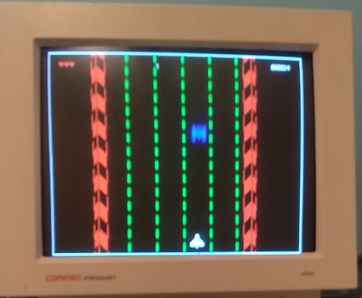

#ICEshooter

ICEshooter is a retro shoot them up made to be run on small FPGA like the ICE40-hx8k.
It started as a holiday project where I wanted to learn how to display an image on a CRT screen with an FPGA and get to know more about the open-source toolchain. In the end it ended up turning into a video-game.

 
##Tools used
The tool needed to generate the bitstream are the following:

* [Yosys](https://github.com/YosysHQ/yosys) for doing the RTL synthesis 
* [next-pnr](https://github.com/YosysHQ/nextpnr) to do the place and route
* [IceStorm](https://github.com/cliffordwolf/icestorm) to generate the bitstream and program the FPGA

##Using the Makefile

You can build the bitstream using:

```sh
make gen
make flash
```

To see the schematics:

```sh
make show
```

To do the synthesis and launch next-pnr's gui:

```sh
make pnr
```

The ```sim``` option will generate a simulation but the the testbench doesn't do much.
